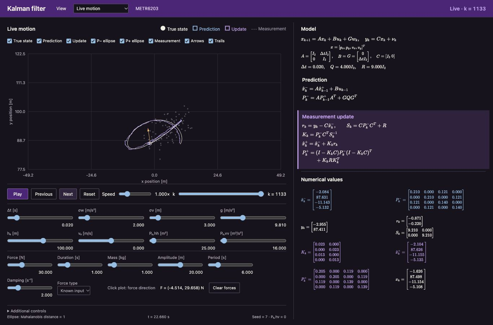
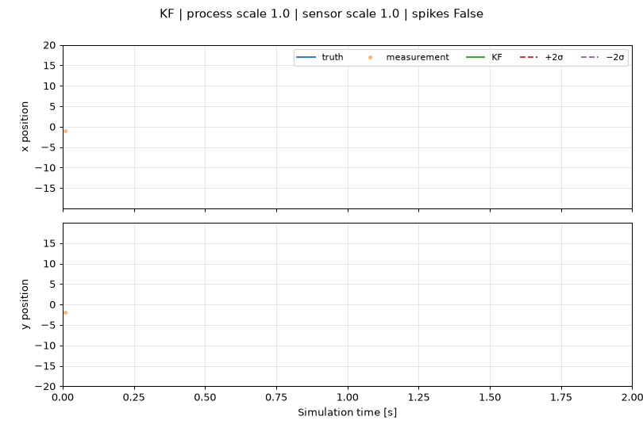

# Kalman demo

A demonstration of estimating 2D motion from noisy position measurements. Use the **browser lab** for a presentation, the **Matplotlib/Pygame demo** for live keyboard control, or the **notebook** for the equations and repeatable comparisons.

## Browser demo

Open [`web/index.html`](web/index.html) in a modern browser. KaTeX and its fonts are included locally; there are no external requests or build steps. Alternatively:

```sh
python3 -m http.server 8000 --bind 127.0.0.1
# Open http://localhost:8000/web/
```



**Live motion** is the default view. It runs continuously at wall-clock speed when speed is 1×, with a periodic reference path and a damped controller. The state is `[px, py, vx, vy]`; measurements contain x/y position only. The controller acceleration and gravity are known inputs. Process disturbances are independent acceleration noise, propagated through `G Q Gᵀ`.

Click inside the plot to apply a force pointing from the current true position towards the clicked position. Set force magnitude in newtons, duration in seconds, and mass in kilograms using sliders. **Known input** supplies the resulting acceleration `F/m` to both the plant and filter prediction; **Disturbance** supplies it only to the plant. The force arrow is scaled by 0.2 metres per newton. Repeated clicks add forces; Clear forces cancels them.

All numerical settings use sliders. Noise, gravity, timestep, mass, periodic amplitude/period, damping, and assumed noise change the ongoing run. Initial height/velocity/covariance sliders restart from the chosen initial conditions when released. Pause freezes simulation time and force expiry; Previous/Next and the iteration slider inspect the stored last eight seconds without regenerating measurements. Resuming returns to the newest state. Sensor gaps and outliers can repeat every eight seconds; smoother comparison shows positional errors and RMSE.

Real-time playback uses a fixed-step accumulator driven by elapsed animation-frame time. The default timestep is 0.02 seconds, and mathematical values redraw at up to 20 Hz. Long browser stalls are limited to 0.25 seconds of catch-up per frame; a suspended/background tab is not treated as a reliable wall-clock timer.

Choose **State space · 25 steps** for the original height/velocity teaching view described below. Its playback also uses simulation time: prediction and update each occupy half a sampling interval.

The state is `[h, v]`: height in metres and vertical velocity in metres per second. The plot uses velocity on the horizontal axis and height on the vertical axis. A height measurement spans the plot as a horizontal dashed line.

The browser stores 25 iterations from seed 7. Each has a prediction and measurement-update stage. Play/Pause, Previous, Next, Reset, speed, and iteration selection operate on those stored results. Next completes the current stage, then advances one stage per click. Previous returns to the previous stage endpoint; from the first prediction it returns to the initial estimate. The slider selects an iteration's completed update. Space toggles playback; left/right arrows step when a form control does not have focus.

Visibility controls independently hide the true state, predicted estimate, updated estimate, either covariance ellipse, measurements, arrows, or trails. Blue denotes prediction and lavender denotes update. The interface uses a dark background with UQ purple accents. Equations and numerical matrices follow the active stage. During animation, active values and covariance interpolate between the stored endpoints; a percentage identifies the transition. At stage endpoints, values match the stored algorithm results exactly. Pending update values are blank until the update stage.

The implemented model is forward Euler:

- `A = [[1, dt], [0, 1]]`, `B = G = [[0], [dt]]`, `u = -g`, `C = [[1, 0]]`.
- Acceleration disturbance variance is `Q = sigma_w²`; position measurement variance is `R = sigma_nu²`.
- Prediction covariance is `A P Aᵀ + G Q Gᵀ`; measurement update uses the Joseph form.
- Initial estimate and true state share the selected initial height/velocity. Initial covariance is diagonal, with the entered variances.
- Covariance ellipses use the eigenvalues/eigenvectors of P and Mahalanobis radius one. Both coordinates are transformed to the corresponding axis scale, preserving the displayed height/velocity units. A radius-one 2D Gaussian ellipse contains about 39.35% probability.

Changing a valid parameter regenerates the fixed-seed data and resets playback. Measurement standard deviations must be positive so the displayed ordinary `S⁻¹` exists, including zero initial covariance and zero process noise.

**Additional controls** retains noise-assumption mismatch, a stored measurement gap at iterations 11–15, a sensor outlier, and an optional height-time comparison with IIR/SMA. A missing measurement skips correction; state and covariance remain at their predicted values and update equations are inactive. Outliers change the chosen measurement, not the generated true trajectory. Matching noise is enabled by default; when disabled the algorithm panel displays the filter's assumed Q/R. Browser IIR uses `alpha = 0.8`, and SMA uses five samples. These are position smoothers, so their comparison uses a height-time plot rather than invented velocity estimates.

The mathematics is rendered with [KaTeX](https://katex.org/docs/browser.html), version 0.19.0. Its MIT licence is preserved in `web/vendor/katex/LICENSE`.

## Python interactive demo

Use Python 3.11 or newer. Python 3.11–3.13 typically provides the easiest Pygame wheel installation; newer versions may need SDL development libraries to build Pygame.

```sh
python3 -m venv .venv
source .venv/bin/activate       # Windows: .venv\Scripts\activate
python -m pip install -r requirements.txt
python kalman_live.py
```

Click the small Pygame window to give it keyboard focus. Matplotlib opens rolling x/y time plots and a 2D trajectory view with acceleration arrows and a Kalman uncertainty ellipse.

| Control | Action |
| --- | --- |
| Arrow keys | Apply x/y acceleration, magnitude 30 |
| `1`, `2`, `3`, `4` | Kalman, Luenberger observer, IIR, moving average |
| `t` | Toggle periodic sensor/process noise bursts |
| `.`, `,` | Increase process/sensor noise scale by 0.1 |
| Shift + `.`, Shift + `,` | Decrease the corresponding noise scale |
| `=`, `-` | Change the spatial viewing range |
| Esc, Ctrl+C, or closing a window | Exit cleanly |

Noise scales start at 1 so the filtering effect is visible. Use `--process-noise 0 --sensor-noise 0` for the deterministic case. `--duration`, `--seed`, `--mode`, and `--spikes` configure a run; `--help` lists options. A slow GUI may run slower than wall time: labels always show simulation time.

## How it works

The Python state is `[x, y, vx, vy]`. Each 0.01-second step applies a constant-velocity transition, known control acceleration, downward acceleration of 0.0981, and random acceleration disturbances. Position measurements add independent Gaussian noise.

1. **Predict:** `x_prior = A x + G a`, `P_prior = A P Aᵀ + Q`.
2. **Gain:** `S = C P_prior Cᵀ + R`, `K = P_prior Cᵀ pinv(S)`.
3. **Correct:** `x_post = x_prior + K (z − C x_prior)`.
4. **Uncertainty:** Joseph update `(I − KC) P_prior (I − KC)ᵀ + K R Kᵀ`.

Here **Q is state process covariance** and **R is sensor covariance**. Nominal acceleration standard deviation is 20 times the process scale; sensor position standard deviation is 2 times the sensor scale. Acceleration enters via `G = [dt² I / 2; dt I]`. The Python filter knows the controls and noise covariance, including the scheduled bursts. It does **not** demonstrate automatic outlier detection or noise estimation.

The Luenberger observer uses fixed discrete poles 0.92, 0.93, 0.94, 0.95. IIR is exponential smoothing with `alpha = 0.95`; SMA averages exactly 20 measurements. These coefficients are tied to the sampling interval. Simple smoothers can lag moving targets, while a motion model estimates velocity as well as position.

The time plots show marginal ±2σ position bands (approximately 95.45% under the Gaussian model). A two-sigma **2D ellipse** contains approximately 86.47% probability, not 95%. For a 95% two-dimensional Gaussian region, use a radius factor of approximately 2.448. These are model-based regions, not guaranteed coverage under mismatched noise, abrupt motion, or outliers.

## Notebook and presentation exports

```sh
python -m pip install -r requirements-notebook.txt
jupyter lab kalman_demo.ipynb

python kalman_live.py --duration 8 --export outputs/demo.gif
python kalman_live.py --duration 8 --export outputs/demo.mp4
python kalman_live.py --duration 8 --export outputs/demo.png
```

Exports run a seeded scripted trajectory without opening GUI windows. PNG is the final rolling time view; GIF/MP4 animate the time plots. MP4 needs FFmpeg installed on PATH; GIF uses Pillow. Avoid exporting the default 200-second run as a GIF: the writer stores frames in memory. See [Matplotlib animation documentation](https://matplotlib.org/stable/users/explain/animations/animations.html).



For a suggested five-minute walkthrough and more UI ideas, see [presentation notes](docs/presentation.md). For the initial review and fixes, see [project review](docs/review.md).

## Verification

```sh
python -m unittest discover -s tests -v
node tests/browser-model.test.js    # Optional Node.js checks
node tests/browser-ui.test.js
node tests/live-model.test.js
```

Tests cover repeatability, tracking error, known acceleration, the SMA window, IIR initialization, zero noise, covariance stability under bursts, Euler dynamics, Joseph updates, eigenvalue ellipses, stored playback, LaTeX rendering, visibility toggles, parameter changes, and missing measurements.

## Project layout

- `kalman_model.py`: import-safe simulation and estimators.
- `kalman_live.py`: live UI and presentation export CLI.
- `kalman_demo.ipynb`: equations, seeded comparison, and error metrics.
- `web/`: standalone two-state browser demonstration.
- `docs/`: review, presentation guide, and small generated preview.
- `tests/`: numerical regression checks.

This demo was adapted from a teaching script for METR6203. All motion and measurements are simulated.
